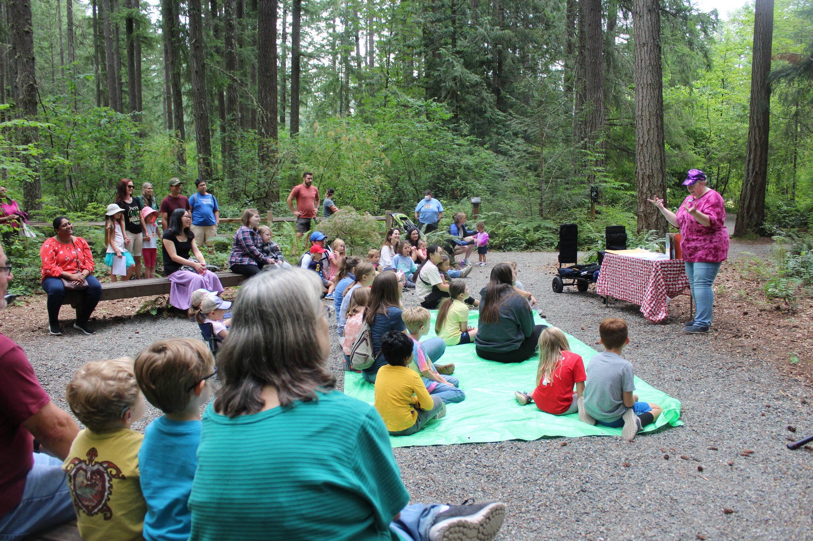
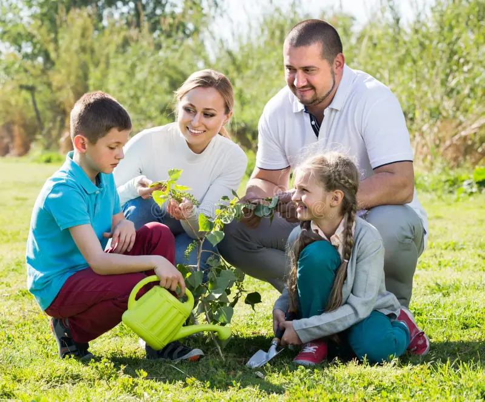

# All About Trees

All about trees is a simple website for parents to

Introducing children to trees and encouraging

them to participate in tree-planting activities

is a step towards promoting an eco-friendly lifestyle

in their early years 🌳.

## Table of contents

- [All About Trees](#all-about-trees)
  - [Table of contents](#table-of-contents)
  - [General info](#general-info)
  - [Photo](#photo)
  - [Technologies](#technologies)
  - [Status](#status)
  - [Contact](#contact)

## General info

If you're a parent, who acknowledges

the importance of trees for our planet

you probably understand the role trees

play in children's lives. Your appreciation

for nature can have a positive impact

on a child's growth and teach them

about caring for the planet in their younger years

## Photo

## Technologies

- **Node 20.1.0:** hey are responsible for validating transactions
- and adding new blocks to the chain.
- **Vs code:** a streamlined code editor with support for development
- operations like debugging, task running, and version control.
- **html:** to defines the content and structure of web content
- **CSS:** for styling web pages layout
- **GitHub:** Utilizing Git for version control and GitHub for collaboration.
- **Markdown:** Creating well-formatted introduction files using Markdown.
- **Linting Checks:** Ensuring code consistency and quality.
- **agile methodology:** Managing tasks and tracking progress.

## Status

Project is: _in progress_

## Contact

By [group-3-agile-methodology]
