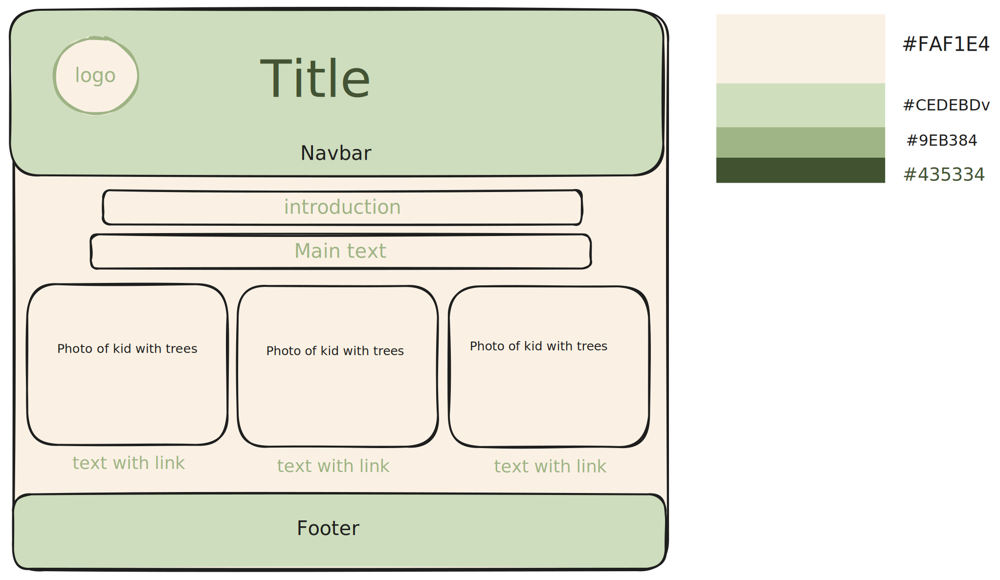

# Design

## Project's design overview

<!-- give an overview of your project's design -->

Our project aims to provide a user-friendly for children and parents interested
in learning about trees. The design focuses on simplicity and clarity to cater
to the target audience.

<!-- describe the reasoning behind your group's design and wireframe -->

<!-- include other centralized decisions like fonts, palates, ... -->

**Color Palette:** Utilizing a calming and natural color palette:

- #FAF1E4, #CEDEBD, #9EB384, #435334
  [Color Pattern Reference](https://colorhunt.co/palette/faf1e4cedebd9eb384435334)

## Wireframe(s)

<!-- provide a link to your wireframe documenting on Figma, or wherever it is -->

🎨 Link to
[wireframe](https://excalidraw.com/#room=1ccaaa45830b75709701,c9nJiY3NN6TaGyzkvEKH1A)
